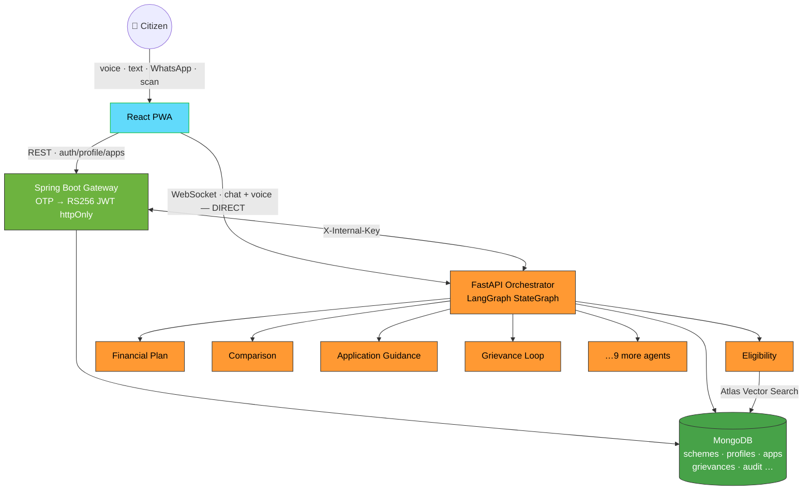
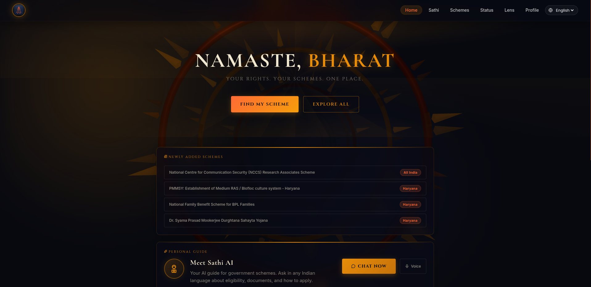
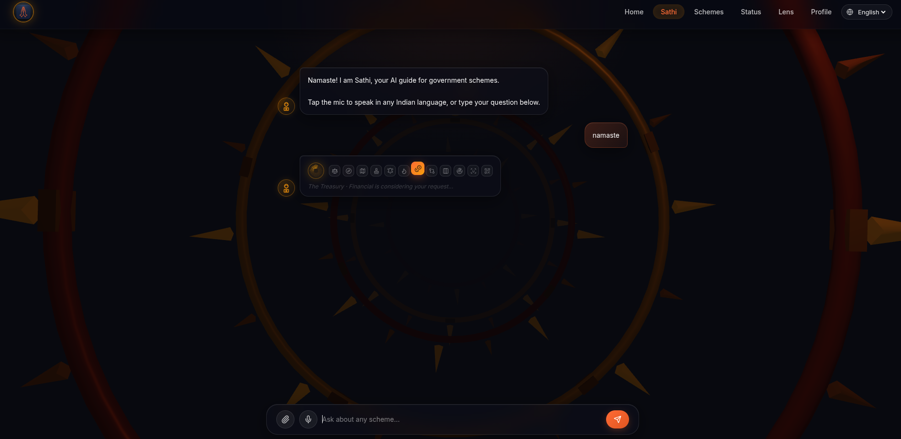
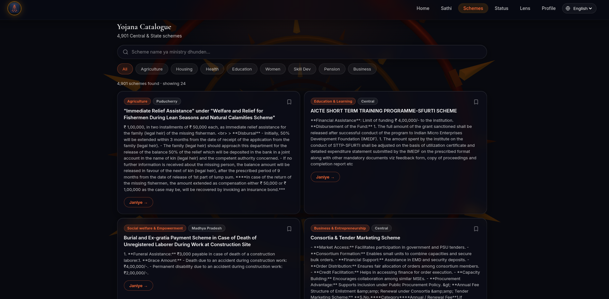
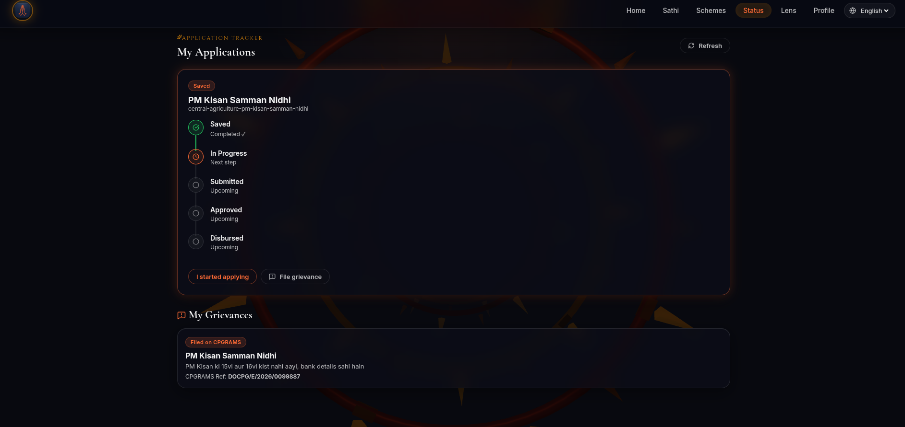
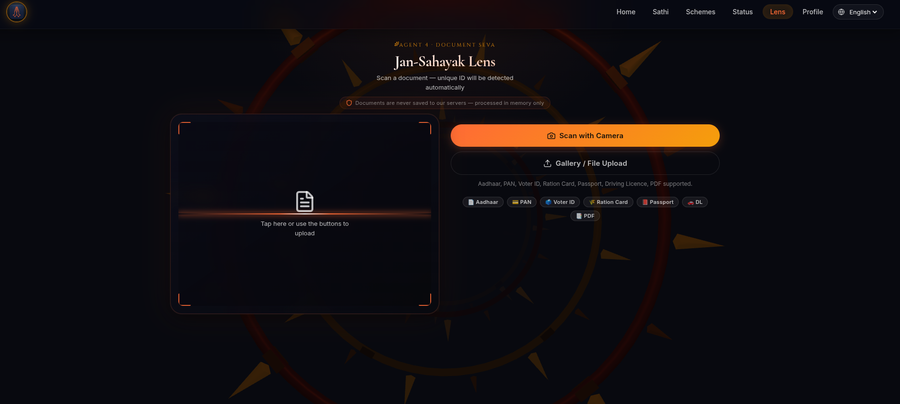
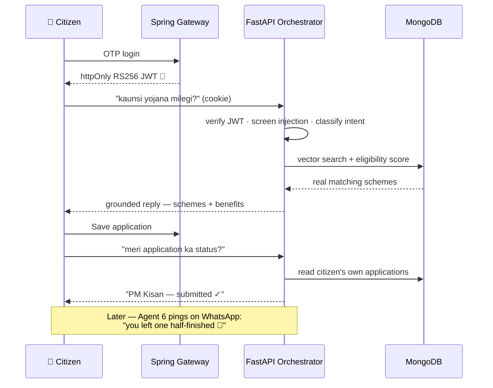

<!-- ░░░░░░░░░░░░░░░░░░░░░░░░░  YOJNA SETU  ░░░░░░░░░░░░░░░░░░░░░░░░░ -->

<div align="center">


<a href="https://github.com/RudyMontoo/YojnaSetu_v5">
  
</a>

<br/><br/>


</div>

<br/>

<!-- ─────────────────────────────  THE HOOK  ───────────────────────────── -->

<div align="center">

### A 62-year-old farmer in Uttar Pradesh opens WhatsApp and types in Hindi.

</div>

```text
👵  "main UP ka kisan hoon, meri saalana aay 1.5 lakh hai. mujhe kya milega?"

🏛️  Namaste! Aapke liye ye yojnayein hain —
    • PM Kisan Samman Nidhi        →  ₹6,000 / saal, seedhe khaate mein
    • Natural Farming Mission      →  ₹15,000 / hectare
    • Agriculture Infrastructure Fund

    Kaunsi ke liye apply karna hai? Main step-by-step bataunga. 📄
```

<div align="center">

**That's it. No portal. No form. No English. No middleman.**
Just a conversation that ends with money in a bank account.

</div>

---

## 🎯 Why Yojna Setu exists

> [!NOTE]
> India runs **3,500+ welfare schemes** worth *lakhs of crores*. The people they were built for — farmers, students, widows, the elderly, daily-wage workers — often **never find them.** Buried in portals they can't navigate, written in a language that isn't theirs, gated behind forms and jargon and information they don't have.

Yojna Setu closes that gap with **one multilingual conversation.** It takes a citizen from *"what am I even eligible for?"* → discovery → application guidance → document checks → grievance tracking → and, for pensioners, **fully-offline proof-of-life** — all in their own language, by voice or WhatsApp.

Not a search engine over scheme PDFs. A **fleet of 13 specialised AI agents** that actually reason about *your* situation against *real, structured* government data.

---

## ✨ What makes it different

<table>
<tr>
<td width="50%" valign="top">

### 🗣️ Speaks your language — literally
22 Indian languages, **voice-first**. Real-time speech in and out via Pipecat + Sarvam (Saaras v3 STT, Bulbul v3 TTS) — the *same* 13-agent brain answers whether you type, talk, or WhatsApp.

</td>
<td width="50%" valign="top">

### 🤖 13 agents, not one chatbot
A LangGraph `StateGraph` routes each message to the right specialist — eligibility, discovery, comparison, financial planning, grievances — each grounded in Mongo data, never hallucinating a scheme.

</td>
</tr>
<tr>
<td width="50%" valign="top">

### 📶 Works when the network doesn't
Pensioners prove they're alive **offline** — an RSA-2048 key signed in the browser (WebCrypto), turned into a QR + sync-on-reconnect. No connectivity required to survive.

</td>
<td width="50%" valign="top">

### 🔒 Built for real citizen data
DPDP-2023 compliant from day one: AES-256 field encryption, SHA-256 Aadhaar hashing (never raw), httpOnly RS256 JWTs, append-only audit logs, PII stripped from every log line.

</td>
</tr>
</table>

---

## 🏗️ Architecture at a glance



> [!IMPORTANT]
> **Voice goes *straight* to FastAPI over WebSocket — never through Spring Boot.** Spring is thread-per-connection (blocking); 100 concurrent voice calls would exhaust its pool. FastAPI is async ASGI and holds thousands of sockets natively. REST (auth, data) stays on Spring; every WebSocket lives on FastAPI. That split is the backbone of the whole system.

---

## 🛰️ The 13-agent fleet

| # | Agent | What it does for the citizen |
|:--:|---|---|
| 🧭 | **Orchestrator** | Reads intent, routes to the right specialist, screens for prompt-injection first |
| 1 | **Eligibility** | Vector-searches real schemes + scores them against *your* profile |
| 2 | **Discovery** | Keeps the catalogue fresh — 3,500+ schemes with structured eligibility rules |
| 3 | **Application Guidance** | Step-by-step how-to-apply + reads the *live* government form for you |
| 4 | **Document Verify** | PPO ↔ Aadhaar name/DOB mismatch check for pensioners |
| 5 | **Grievance** | Files & tracks complaints; guides CPGRAMS self-filing, records the reference |
| 6 | **Nudge** | WhatsApp reminders when you start an application but don't finish it |
| 7 | **Financial Planning** | Your total yearly benefit across all schemes, ranked by effort |
| 8 | **Comparison** | Two schemes, side by side, grounded in real data |
| 9 | **CSC Assist** | Helps operators find document alternatives — honest "no substitute" when true |
| 10 | **Analytics** | Aggregate drop-off / demand insights for administrators |
| 11 | **Biometric Assist** | Face-liveness for at-home proof-of-life *(pension release — in progress)* |
| 12 | **Offline Survival Proof** | RSA-signed Digital Life Certificate that works with **zero network** |

---

## 📱 Inside the app

<table>
<tr>
<td width="50%"></td>
<td width="50%"></td>
</tr>
<tr>
<td valign="top"><b>🏠 Home — <i>Namaste, Bharat</i></b><br/>The landing: <i>Find My Scheme</i> or explore all, a live feed of newly-added schemes across states, and a one-tap door to Sathi (chat or voice).</td>
<td valign="top"><b>💬 Sathi — the AI guide</b><br/>Ask about any scheme by <b>voice or text in any Indian language</b>. One message routes through the 13-agent LangGraph brain — eligibility, financial planning, comparison, grievances — grounded in real data.</td>
</tr>
<tr>
<td width="50%"></td>
<td width="50%"></td>
</tr>
<tr>
<td valign="top"><b>📚 Schemes — Yojana Catalogue</b><br/>All <b>4,901 central & state schemes</b>, searchable with sector filters (Agriculture, Housing, Health, Pension…). Each card shows the real benefit + eligibility, extracted into structured rules.</td>
<td valign="top"><b>📊 Status — Application Tracker</b><br/>Every saved application through its lifecycle (Saved → In&nbsp;Progress → Submitted → Approved → Disbursed), plus <b>My Grievances</b> with their CPGRAMS reference numbers.</td>
</tr>
<tr>
<td width="50%"></td>
<td valign="top"><b>🔎 Lens — Jan-Sahayak (Agent 4)</b><br/>Scan an <b>Aadhaar, PAN, Voter ID, Ration Card, Passport or DL</b> — the ID is auto-detected by a local vision model that reads any Indian script. <b>Never saved to a server — processed in memory only.</b></td>
</tr>
</table>

<sub>Not shown: real-time voice call, offline Digital Life Certificate with face-liveness (Pension Seva), WhatsApp nudges, and the CSC-operator dashboard.</sub>

---

## 🎬 One citizen journey, end to end



---

## 🧠 The intelligence layer

> [!TIP]
> **Three LLMs, one graceful chain.** Every reasoning call tries **Gemini 2.5 Flash** first → falls back to **Groq (Llama-3.3-70B)** on quota → then to a **local Ollama** model, so the app *never* hard-fails on a dead quota. Bulk jobs (extracting eligibility rules for thousands of schemes) run entirely on the free local model — ₹0, no limits.

- **Retrieval** — MongoDB Atlas `$vectorSearch` in prod, brute-force cosine locally · `all-MiniLM-L6-v2` (384-dim)
- **Grounding** — agents answer *only* from real Mongo scheme docs; a scheme it can't cite, it won't invent
- **Guardrails** — prompt-injection screen + PII masking on **every** input before it reaches any model

---

## 🛠️ Tech stack

<details open>
<summary><b>Expand full stack</b></summary>

<br/>

| Layer | Technology |
|---|---|
| **Orchestration** | LangGraph `StateGraph` · shared turn-logic across REST / WebSocket / voice |
| **AI service** | FastAPI · Python 3.12 · async ASGI |
| **Gateway** | Spring Boot 3.2 · Java 17 · OTP auth · Bucket4j rate limiting |
| **Database** | MongoDB (Atlas prod / Docker dev) |
| **Auth** | Phone OTP → RS256 JWT in httpOnly · `SameSite=Strict` cookies |
| **Crypto** | AES-256-GCM fields · SHA-256+salt Aadhaar/PPO · RSA-2048 WebCrypto (offline DLC) |
| **Voice** | Pipecat · Sarvam Saaras v3 (STT) · Bulbul v3 (TTS) · server-side VAD |
| **Messaging** | Twilio WhatsApp (Business API) |
| **Frontend** | React + Vite · installable PWA · code-split routes · Framer Motion |
| **Testing** | 90 pytest + 15 JUnit · CI on every push |

</details>

---

## 🚀 Run it locally

<details>
<summary><b>Step-by-step</b></summary>

<br/>

**Prerequisites:** Python 3.12 · Node 18+ · Java 17 · Maven · Docker

```bash
# 1 — database
docker run -d --name yojna-mongo -p 27017:27017 mongo:7

# 2 — AI service (run from repo root)
cd ai_service && python3 -m venv venv && source venv/bin/activate
pip install -r requirements.txt
cp .env.example .env          # fill GEMINI/GROQ/SARVAM keys + MONGODB_URI
cd .. && uvicorn ai_service.main:app --reload --port 8000

# 3 — gateway
cd deploy/backend/spring-gateway
mvn spring-boot:run -Dspring-boot.run.profiles=local

# 4 — frontend
cd frontend && npm install && npm run dev
```

> 🌐 App → `localhost:5173` · API docs → `localhost:8000/docs` · Gateway → `localhost:8080`

</details>

---

## 🛡️ Security & compliance

| Guarantee | How |
|---|---|
| **No PII in the clear** | AES-256-GCM on name/dob/phone before every write |
| **Aadhaar never stored raw** | SHA-256 + server salt, one-way, never decrypted |
| **No tokens in JavaScript** | RS256 JWT lives only in httpOnly cookies |
| **Nothing leaks to logs** | PII-redaction filter strips Aadhaar/phone/PAN/email from every log line |
| **Voice is ephemeral** | Audio processed in memory, never written to disk — only the transcript persists |
| **Right to erasure** | DPDP cascade wipes a citizen across every collection in seconds |

---

<div align="center">


<sub>Built for social good · every scheme sourced from verifiable Indian government public portals</sub>

</div>
