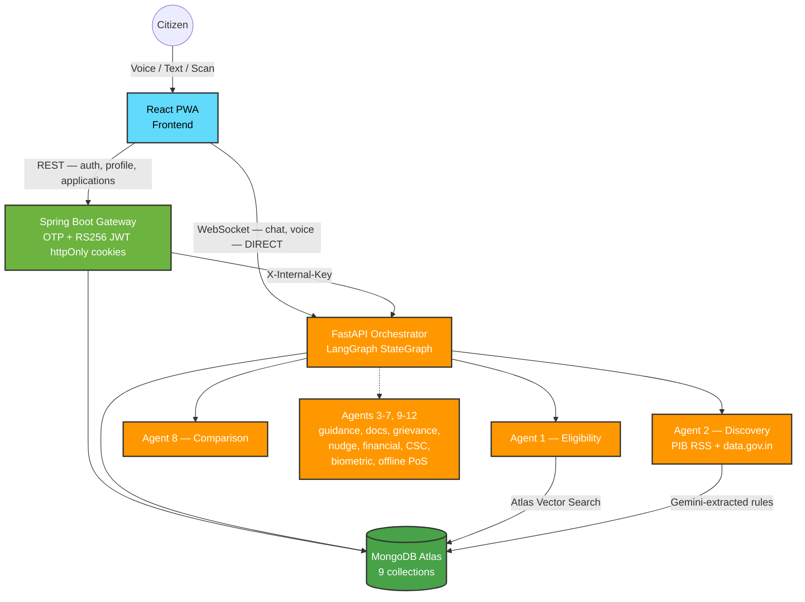

<div align="center">
  <h1>🏛️ Yojna Setu</h1>
  <h3>AI-Powered Government Welfare &amp; Pension Assistant</h3>
  <p><b>"Connecting Citizens to Their Rights — Jan Jan ko Yojana se Jodo 🇮🇳"</b></p>

  <p>
    
    
    
    
    
  </p>
  <p>
    
    
    
  </p>
</div>

---

## 📖 Table of Contents
1. [What is Yojna Setu?](#-what-is-yojna-setu)
2. [v5.0 — 12-Agent Architecture](#-v50--12-agent-architecture)
3. [Build Status](#-build-status)
4. [Tech Stack](#-tech-stack)
5. [Getting Started](#-getting-started)
6. [API Reference](#-api-reference)
7. [Security &amp; Compliance](#-security--compliance)
8. [Project Docs](#-project-docs)

---

## 🌟 What is Yojna Setu?

India has 419+ active welfare schemes and 194M+ elderly citizens who often can't access the pensions they're already enrolled for. Most citizens never discover the schemes they qualify for — complex portals, language barriers, and information asymmetry get in the way. When they *are* enrolled, biometric authentication failures and payment-routing errors silently block disbursement.

**Yojna Setu v5.0** solves both problems with one platform: a 12-agent LangGraph system that takes a citizen from *"what am I eligible for?"* through scheme discovery, application guidance, document verification, and — for pensioners — biometric-assisted and fully offline proof-of-life verification.

- 🗣️ **Voice-first** — 22 Indian languages via Pipecat + Sarvam Saaras v3 / Bulbul v3
- 🤖 **12 specialized agents** — eligibility, discovery, application guidance, document/PPO verification, grievance + NPCI monitoring, nudges, financial planning, comparison, CSC assist, analytics, biometric assist, and offline survival proof
- 🔒 **DPDP 2023 compliant** — field-level AES-256 encryption, SHA-256 Aadhaar hashing, immutable audit logs, consent-first writes
- 🌐 **Real data** — 419 schemes migrated into MongoDB with Gemini-extracted structured eligibility rules, not free-text guesses

---

## 🏗️ v5.0 — 12-Agent Architecture



Full routing table, agent responsibilities, and MongoDB schema live in [`CLAUDE.md`](./CLAUDE.md) — the canonical architecture reference for this repo.

---

## 🚧 Build Status

This is a solo rebuild in progress, tracked phase-by-phase against [`docs/plans`](./docs/plans) and [`docs/adr`](./docs/adr). Status as of this README:

| Layer | Status |
|---|---|
| **Orchestrator + GraphState** | ✅ Built — LangGraph `StateGraph`, intent classifier, Gemini 2.5 Flash with automatic Groq fallback |
| **Agent 1 — Eligibility** | ✅ Built — ReAct-style retrieval + re-ranking over real Mongo scheme data |
| **Agent 2 — Discovery** | ✅ Built — content-hash diff pipeline + Gemini normalizer; PIB RSS / data.gov.in sources wired but not yet configured (see below) |
| **Agent 8 — Comparison** | ✅ Built — Atlas Vector Search-backed side-by-side comparison |
| **Agents 3-7, 9-12** | ⏳ Not yet built |
| **Scheme data** | ✅ 419 schemes migrated (276 central + 143 across 37 states) with Gemini-extracted structured `eligibilityRules` |
| **Spring Boot Gateway** | ✅ Rewritten — MongoDB + OTP auth + RS256 JWT httpOnly cookies + AES-256-GCM field encryption + rate limiting (see [ADR-001](./docs/adr/ADR-001-mongodb-otp-httponly-jwt-auth.md)) |
| **DPDP erasure / Applications API** | ⏳ Not yet built |
| **Frontend** | ⏳ Still on Supabase auth — repointing to the new gateway is planned, not yet started |
| **Voice pipeline (Sarvam)** | ✅ Already production-shaped from the prior architecture, reused as-is |

**Known gaps, stated plainly:** PIB redesigned their site and the old RSS feed URLs no longer resolve — Agent 2's PIB source is wired but needs a human to find the current feed URL. data.gov.in needs an API key + specific dataset resource IDs that can't be guessed. Both degrade gracefully (logged, not silent) rather than blocking the rest of the system.

---

## 🛠️ Tech Stack

<details open>
<summary><b>Click to expand</b></summary>

| Layer | Technology |
|---|---|
| **Orchestrator** | LangGraph `StateGraph`, Gemini 2.5 Flash (Groq `llama-3.3-70b` automatic fallback) |
| **AI Backend** | FastAPI (Python 3.12) |
| **Data Gateway** | Spring Boot 3.2 (Java 17/21), REST + OTP auth |
| **Database** | MongoDB (Atlas in prod, local Docker in dev) — 9 collections per `CLAUDE.md` |
| **Vector Search** | MongoDB Atlas `$vectorSearch` in prod, brute-force cosine fallback locally; `all-MiniLM-L6-v2` (384-dim) embeddings |
| **Auth** | Phone OTP (Twilio, dev-mode console fallback) → RS256 JWT in httpOnly + `SameSite=Strict` cookies |
| **Encryption** | AES-256-GCM field-level (name/dob/phone), SHA-256 + salt (Aadhaar/PPO — never raw) |
| **Rate Limiting** | Bucket4j (60 req/min/IP) |
| **Voice** | Pipecat + Sarvam Saaras v3 (STT) / Bulbul v3 (TTS), Whisper + gTTS fallback |
| **Vision/OCR** | PaddleOCR + OpenCV (deskew, contour, adaptive threshold), zero-retention |
| **Frontend** | React 19, Vite, React Router 7, Framer Motion *(auth migration to the new gateway pending)* |
| **Web Scraping** | `requests` + BeautifulSoup4, 2s rate limit, `robots.txt`-respecting |

</details>

---

## 🚀 Getting Started

### Prerequisites
- Python 3.12, Node.js 18+, Java 17+, Maven, Docker

### 1 — Clone

```bash
git clone https://github.com/RudyMontoo/YojnaSetu_v5.git
cd YojnaSetu_v5
```

### 2 — Local MongoDB

```bash
docker run -d --name yojna-mongo -p 27017:27017 mongo:7
```

### 3 — AI Service (FastAPI + LangGraph)

```bash
cd ai_service
python3 -m venv venv && source venv/bin/activate
pip install -r requirements.txt
cp .env.example .env   # fill in GEMINI_API_KEY, GROQ_API_KEY, SARVAM_API_KEY, MONGODB_URI

python -m ai_service.scripts.migrate_schemes --all-states   # first run only — seeds 419 schemes
uvicorn ai_service.main:app --reload --port 8000            # run from repo root, not ai_service/
```
> 📖 Interactive API docs at `http://localhost:8000/docs`

### 4 — Spring Boot Gateway

```bash
cd deploy/backend/spring-gateway
openssl genpkey -algorithm RSA -out keys/jwt_private.pem -pkeyopt rsa_keygen_bits:2048
openssl rsa -pubout -in keys/jwt_private.pem -out keys/jwt_public.pem
# create src/main/resources/application-local.properties with encryption.key (openssl rand -base64 32),
# encryption.aadhaar-salt, and app.internal-service-key (must match ai_service's INTERNAL_API_KEY)

mvn spring-boot:run -Dspring-boot.run.profiles=local
```

### 5 — Frontend

```bash
cd frontend
npm install
npm run dev
```
> 🌐 `http://localhost:5173`

---

## 📡 API Reference

<details>
<summary><b>FastAPI (ai_service) — port 8000</b></summary>

| Method | Endpoint | Notes |
|---|---|---|
| `POST` | `/orchestrator/chat` | LangGraph Orchestrator — intent routing to Agent 1/8, real Mongo persistence |
| `POST` | `/orchestrator/admin/discovery/run` | Manually trigger Agent 2 Discovery |
| `GET` | `/health` | Service health |
| `POST` | `/ocr/scan` | Zero-retention document OCR |
| `POST` | `/voice/conversation/*` | Sarvam-powered voice interview |

</details>

<details>
<summary><b>Spring Boot Gateway — port 8080</b></summary>

| Method | Endpoint | Auth | Notes |
|---|---|---|---|
| `POST` | `/api/v2/auth/otp/send` | None | Rate-limited |
| `POST` | `/api/v2/auth/otp/verify` | None | Sets httpOnly JWT cookies |
| `POST` | `/api/v2/auth/refresh` / `/logout` | Cookie | |
| `POST` | `/api/v2/consent` | Cookie | Required before first profile write |
| `GET`/`PATCH` | `/api/v2/profile/me` | Cookie | PII encrypted at rest, decrypted on read |
| `GET`/`PATCH` | `/internal/profile/{userId}` | `X-Internal-Key` | ai_service → Spring Boot only |
| `GET` | `/internal/scheme/{schemeCode}/rules` | `X-Internal-Key` | Structured eligibility rules |

</details>

---

## 🛡️ Security &amp; Compliance

- **JWT**: RS256, httpOnly + `SameSite=Strict` cookies only — never in a response body or `localStorage`
- **PII**: AES-256-GCM field-level encryption on name/dob/phone; Aadhaar/PPO are SHA-256 + salt hashed, raw values never stored
- **Prompt injection & PII masking**: every message is screened before reaching an LLM
- **Audit trail**: append-only `audit_logs`, never updated or deleted
- **DPDP 2023**: consent required before any profile write (erasure cascade endpoint planned, not yet built)

See [ADR-001](./docs/adr/ADR-001-mongodb-otp-httponly-jwt-auth.md) for the reasoning behind the auth/database architecture.

---

## 📄 Project Docs

- [`CLAUDE.md`](./CLAUDE.md) — full architecture reference: MongoDB schema, agent directory, API contracts
- [`docs/adr/`](./docs/adr/) — architecture decision records
- [`docs/plans/`](./docs/plans/) — phased rebuild plan

---

<div align="center">
  <p><i>Built for social good. All scheme data is sourced from verifiable Indian government public portals.</i></p>
</div>
